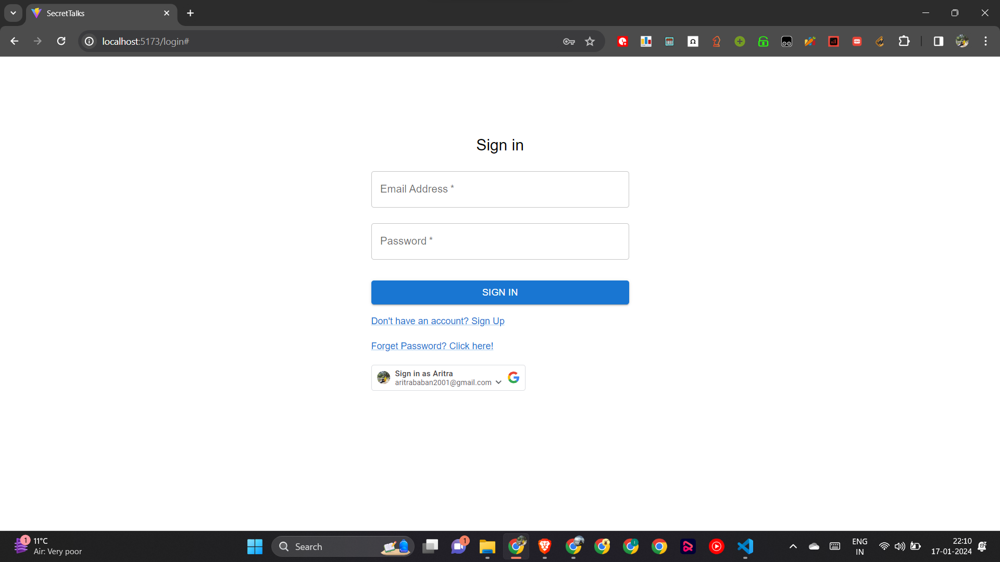
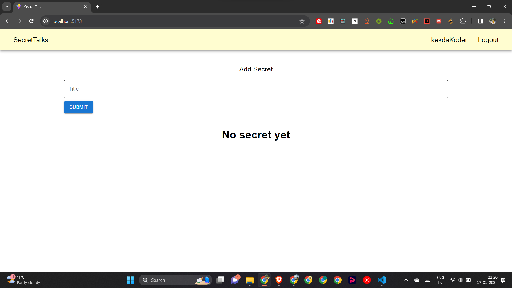
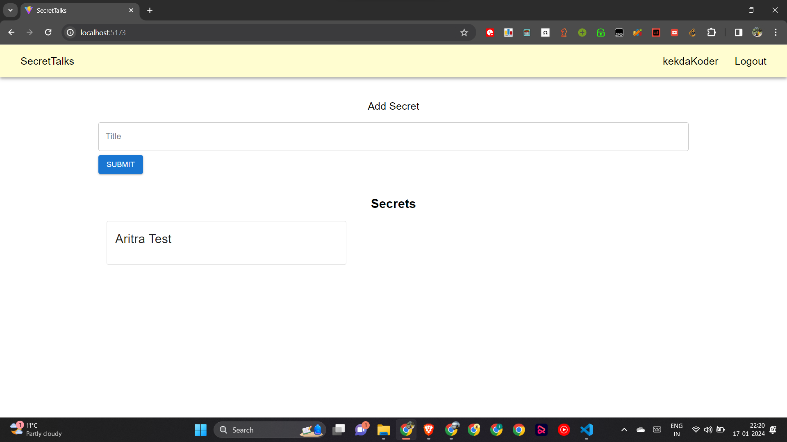
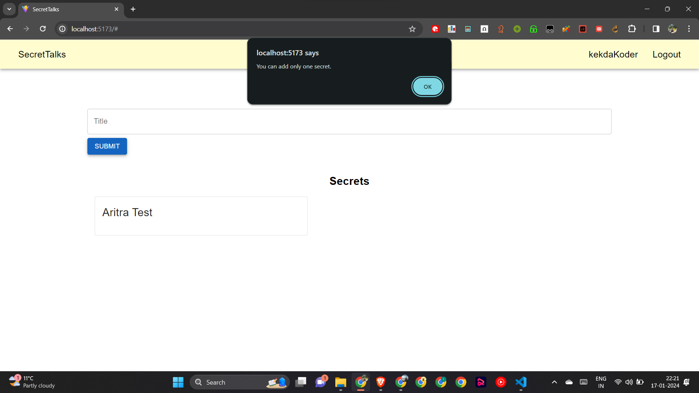
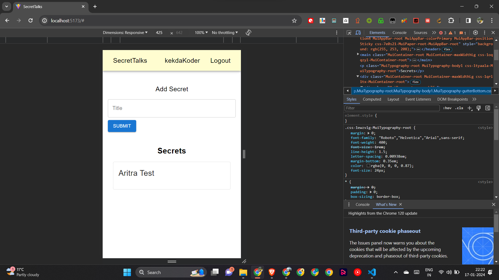

# SecretTalk Web-App

1. First, clone this project.
2. In client folder Frontend code and in server Backend code is placed.
3. Go to client folder, and run npm install for downloading dependencies. Run `npm run dev` for running code. Make sure to change environment variables of backend if you run backend on localhost.
4. Similarly, Go to server folder and run npm install for downloading dependencies. Run `npm start` for running server.
5. For easy of testing, I also pushed env files.

Tech Stack - MERN
CSS Library - MUI

Features:
1. Google Authorisation for Login has been added.
2. JWT verification has been implemented.
3. Custom user-name to be displayed has been added.
4. The person's name who is posting the message has been kept hidden.
5. Design is responsive.
6. Password recovery has also been implemented.

The Login Page:

The Landing Page:

View after saving a secret message:

Alert that only one secret can be added:

Responsive UI:

Demo Video Link:
https://drive.google.com/file/d/1iYhRlUdiKj0LAtkM7tnCFr_6Q4K9-T_v/view?usp=drive_link

